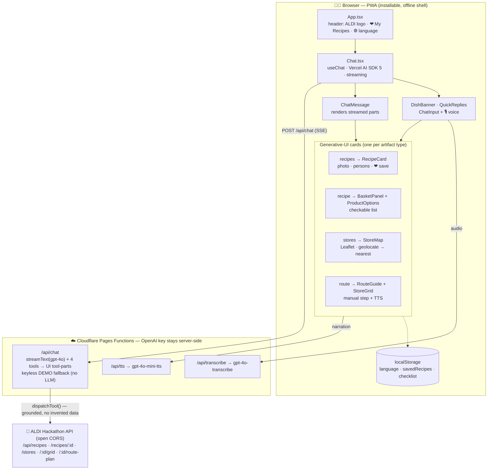
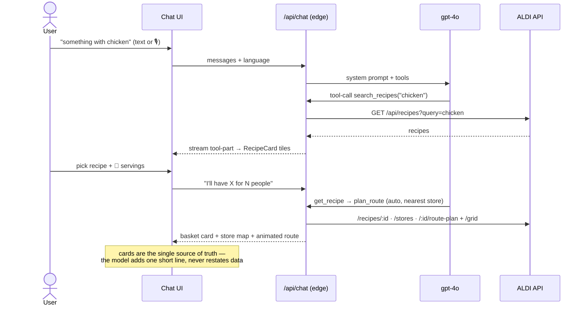
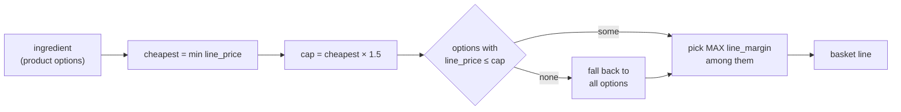

# Architecture

ALDI **Recipe-to-Cart** — turn a craving into a recipe, a real ALDI basket, and
the shortest in-store route to checkout. A Vite + React PWA on Cloudflare Pages,
with edge Functions calling OpenAI and the ALDI Hackathon API.

## System map



## User flow



## Layers

| Layer | Files | Responsibility |
|---|---|---|
| **Shared core** | `lib/types.ts`, `lib/aldi.ts`, `lib/tools.ts`, `lib/lang.ts` | Data contracts, ALDI API client, the 4 tool definitions + `dispatchTool`, React-free i18n. Imported by **both** browser and edge (so the worker never bundles React). |
| **Edge Functions** | `functions/api/*` | The only place the OpenAI key lives (`context.env`, never `process.env`). `chat.ts` runs the tool-calling loop and streams generative-UI parts; degrades to a scripted demo with no key. |
| **Chat shell** | `Chat`, `ChatMessage`, `ChatInput`, `lib/aiChat.ts`, `lib/i18n.tsx` | Streaming transport, message-part → card mapping, 5-language UI (en/ua/ru/hu/es), voice capture. |
| **Showpiece cards** | `RecipeCard`, `BasketPanel`, `ProductOptions`, `StoreMap`, `RouteGuide`, `StoreGrid` + helpers `lib/basket.ts`, `lib/checklist.ts`, `lib/savedRecipes.ts`, `lib/recipeImages.ts` | The visual product — every tool result is a typed `Artifact` that maps to exactly one card. |

## How we maximize ALDI profit

Each ALDI product option carries both a customer **price** and a wholesale cost, so
the API gives us a per-line margin:

```
line_margin = (price − wholesale_price) × packs_needed
line_price  =  price × packs_needed
```

The naïve "max profit" is simply the option with the highest `line_margin` per
ingredient (the API even pre-computes `max_profit_option_id`). **But that almost
always points at the biggest pack** — 1 kg beef for a 500 g need, 4 tins of tomatoes
for one — which doubles the customer's bill and looks absurd in a basket. A shopper
who feels overcharged abandons the cart, so raw margin-max is a false optimum.

So we maximize margin **subject to a no-overbuy guard**: only consider options that
don't overcharge vs. the cheapest valid option (≤ 1.5×), then take the highest margin
among those. ALDI still earns the best *honest* margin on every line, and the basket
stays believable.



```ts
// lib/basket.ts — chooseOption(ingredient, "profit")
const cheapest = byId(ing.cheapest_option_id);
const cap   = cheapest.line_price * 1.5;            // no-overbuy guard
const pool  = ing.product_options.filter(p => p.line_price <= cap);
return (pool.length ? pool : ing.product_options)  // highest honest margin
  .reduce((best, p) => (p.line_margin > best.line_margin ? p : best));
```

- **Basket total** = Σ `line_price` of the chosen options, **minus any items the user
  checks off** as already-owned.
- **ALDI margin** = Σ `line_margin` — tracked internally, **never shown** to the user.
  There is no "cheapest / balanced / profit" toggle: the basket is silently the
  margin-maximising-yet-sane pick.

Real example (Spaghetti Bolognese, 4 portions): naïve margin-max → **€15.53**
(1 kg beef, 4 tins); guarded margin-max → **€9.39** (cheapest is €8.59) — almost all
the extra margin, none of the overbuy.

## Other key decisions

- **One grounded path.** Both the LLM tools and the keyless demo call `dispatchTool`
  → the real ALDI API. The model cannot invent products, prices, or routes; **the
  cards are the single source of truth** and it never restates ingredients, the
  route, or any total.
- **Generative UI.** The server streams `tool-<name>` parts; `ChatMessage` switches on
  the artifact `type` and renders the matching card live as it arrives.
- **Selectable list.** Each basket line and each in-store grab item is tappable to
  mark "already have it / grabbed it"; checked items strike through and drop out of
  the remaining count and total. Shared across cards via a `useSyncExternalStore`
  store (`lib/checklist.ts`), persisted per recipe.
- **Nearest store, no asking.** `StoreMap` geolocates the user, finds the nearest ALDI
  by haversine, frames it, and auto-picks it for routing.
- **Anonymous-first state.** Saved recipes and the checklist persist in localStorage.
- **Always-on link.** No OpenAI key → the scripted demo still runs the full flow over
  the real ALDI API, so the public URL is never blank.

## Stack & deploy

- **Stack:** Vite · React 18 · TypeScript · Vercel AI SDK 5 · Cloudflare Pages +
  Functions · OpenAI gpt-4o (+ gpt-4o-mini-tts, gpt-4o-transcribe) · Leaflet / OSM.
- **Build:** `npm run build` (`tsc -b && vite build`). Bundle ~460 KB JS (~142 KB gzip).
- **Deploy (production):**
  `npm run build && npx wrangler pages deploy dist --project-name=aldi-recipe-cart-bot --branch=main`
  — `--branch=main` is **required**: the local git branch is `master`, but the Pages
  production branch is `main`; without it the deploy publishes only a preview alias and
  the canonical URL keeps serving the old build.
- **Live:** https://aldi-recipe-cart-bot.pages.dev · **Repo:** https://github.com/w1ne/aldi-recipe-cart-bot
